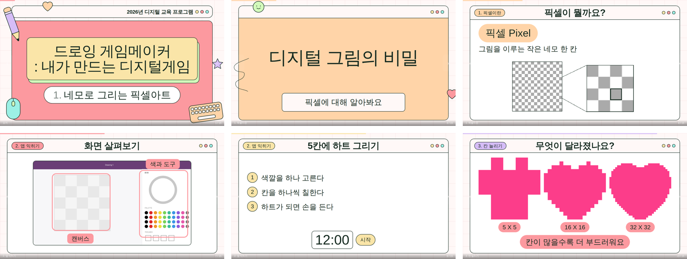

# kyoan-slides

**교안을 그리지 않고 쓰기만 합니다.**

초·중·고 수업 교안의 디자인을 코드에 고정해 두고, 매 차시 쓰는 건 내용뿐입니다.
JSON 명세 파일 하나에서 **의존성 없는 단일 HTML 슬라이드 한 벌**이 나옵니다.

🔗 **[발표자료 보기](https://m22oi.github.io/kyoan-slides/talk.html)** ·
[예시 교안 — 픽셀아트](https://m22oi.github.io/kyoan-slides/example-pixelart.html) ·
[예시 교안 — 초3 코딩](https://m22oi.github.io/kyoan-slides/example-grade3.html)



---

## 왜 만들었나

초·중·고 대상 수업을 계속 하면서, **내용은 차시마다 새로 쓰는데 디자인은 매번 같은 고민**을 반복했습니다.
한 차시 15장을 만들면 장마다 세 번씩 — 글자를 얼마나 크게, 이 장은 무슨 색으로, 장식을 어디에 —
**디자인 판단만 45번**을 했습니다.

직접 만든 12차시 교안을 다시 열어 색·여백·글자 크기·장식 위치를 하나씩 숫자로 적어냈고,
그 규칙을 코드로 옮긴 것이 이 저장소입니다.

| | |
|---|---|
| **45 → 0** | 한 차시에서 내리는 디자인 판단 |
| **0.03초** | 명세에서 슬라이드 15장이 나오기까지 |
| **4줄** | 중·고등용으로 바꿀 때 고치는 코드 |

---

## 쓰는 건 이것뿐

```json
{
  "meta": { "course": "드로잉 게임메이커",
            "lessonTitle": "네모로 그리는 픽셀아트" },
  "slides": [
    { "type": "term", "title": "픽셀이 뭘까요?",
      "term": "픽셀 Pixel",
      "def": "그림을 이루는 작은 네모 한 칸" },
    { "type": "activity", "title": "5칸에 하트 그리기", "timer": 12 }
  ]
}
```

색·글자 크기·장식 위치는 한 줄도 쓰지 않습니다. 챕터 색 순환, 스티커 배치, 제목 크기,
챕터 라벨은 빌더가 정합니다.

---

## 빠르게 해보기

```bash
git clone https://github.com/m22oi/kyoan-slides.git
cd kyoan-slides

# 예시 명세로 슬라이드 만들기
python3 skill/assets/build.py examples/02-coding-grade3.json deck.html

# 브라우저로 열기 (설치·인터넷 불필요)
open deck.html          # Windows: start deck.html
```

빌드가 규칙 위반을 잡아냅니다.

```
16장 → deck.html  (0.0 MB)
규칙 경고 없음
```

### 검증까지 (선택)

```bash
pip install playwright && playwright install chromium
python3 skill/assets/shoot.py deck.html out/   # 전 슬라이드 캡처 + 넘침 검사
python3 skill/assets/topdf.py deck.html deck.pdf
```

---

## 무엇이 자동인가

**디자인 판단**
챕터 색 순환(orange → pink → purple → mint) · 활동 슬라이드 노랑 고정 ·
스티커 자동 배치(콘텐츠와 겹치지 않는 슬롯에서만) · 제목 크기 자동 맞춤 ·
표지 일러스트 배치 · 아이콘 선 굵기 2.5px 고정

**학년 수준 검사** — 초등 중저학년 기준

| 검사 항목 | 기준 | 근거 |
|---|---|---|
| 한 줄 글자 수 | 20자 | 한 번에 눈으로 훑는 길이 |
| 글머리표 개수 | 4개 | 한 장에서 소화하는 덩어리 |
| 활동 단계 | 3단계 | 외워서 따라올 수 있는 수 |
| 본문 글자 크기 | 42px | 교실 뒷자리 가독 하한 |
| 어려운 낱말 | 목록으로 차단 | 한자어를 만나면 읽기가 멈춤 |

**교실 UX** — 목차 점프(`O`) · 발표자 노트(`N`) · 활동 타이머 · 화면 가리기(`B`) ·
전체화면(`F`) · PDF 내보내기 · 터치 스와이프 · 인쇄 CSS

### 학년을 바꾸려면

`skill/assets/build.py` 상단 네 줄만 고칩니다.

```python
MAX_LINE    = 32     # 20 -> 32
MAX_BULLETS = 5      # 4  -> 5
MAX_CHARS   = 180    # 100 -> 180
HARD_WORDS  = []     # 한자어 제한 해제
```

색·여백·장식 규칙은 그대로 둡니다. 학년이 바뀌어도 같은 얼굴로 나갑니다.

---

## 저장소 구조

```
kyoan-slides/
├── skill/                  Claude 스킬 본체
│   ├── SKILL.md            작업 순서 · 디자인 원칙 · 구성 규칙
│   ├── references/         명세 레퍼런스 · 스타일 가이드 · 레이아웃
│   └── assets/
│       ├── template.html   덱 엔진 (CSS + 네비 + 목차 + 타이머)
│       ├── build.py        명세 → HTML + 규칙 검사
│       ├── shoot.py        전 슬라이드 캡처 + 넘침 검사
│       ├── embed_images.py 스크린샷 압축·내장
│       ├── embed_font.py   Paperlogy 서브셋 내장
│       └── topdf.py        PDF 내보내기
├── examples/               예시 명세 (JSON)
├── docs/                   GitHub Pages — 랜딩 · 발표자료 · 예시 덱
└── dist/
    ├── kyoan-slides.skill  스킬 설치 패키지
    └── kyoan-slides.md     단일 파일 버전 (도구 코드 포함)
```

## Claude 스킬로 쓰기

`dist/kyoan-slides.skill` 을 Claude에 올리면 스킬로 설치됩니다.
설치 후에는 이렇게만 말하면 됩니다.

> "4차시 교안 만들어줘. 주제는 픽셀아트로 캐릭터 만들기, 초등 3학년, 80분."

단일 파일이 편하면 `dist/kyoan-slides.md` 를 쓰세요 — 빌더와 템플릿 코드가 부록으로 들어 있습니다.

---

## 폰트

원본 스타일 폰트는 **[Paperlogy](https://github.com/fonts-archive/Paperlogy)** 입니다
(SIL Open Font License — 상업적 이용·수정·재배포·웹폰트 임베딩 허용).

기본값은 Google Fonts 폴백 스택(Black Han Sans · Jua · Gowun Dodum · Noto Sans KR)이라
설치 없이 바로 열립니다. 원본 그대로 쓰려면 `embed_font.py` 로 덱에 심으세요.

```bash
python3 skill/assets/embed_font.py Paperlogy-7Bold.ttf Paperlogy-4Regular.ttf deck.html
```

## 라이선스

- **코드** (`skill/assets/*.py`, `template.html`) — [MIT](LICENSE)
- **문서·예시 교안·발표자료** (`skill/*.md`, `references/`, `examples/`, `docs/`) —
  [CC BY 4.0](LICENSE-CONTENT)

예시 교안에 쓰인 사업명·기관명은 공개용으로 중립하게 바꾼 것입니다.
디자인 모티프(파스텔 브라우저 창·모눈 배경)는 직접 만든 교안에서 뽑아 CSS와 SVG로 다시 그렸습니다.
